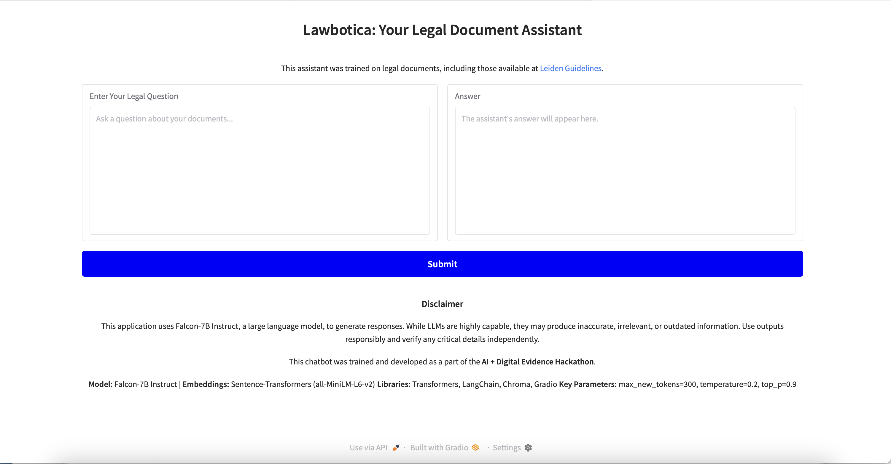

# Lawbotica: Your Legal Assistant Bot

**Lawbotica** is an AI-powered legal assistant designed to analyze legal documents, answer questions, and provide insightful responses. Built on state-of-the-art machine learning models, it combines natural language processing and vector search technology to make navigating legal documents seamless.

This project was developed as part of the AI + Digital Evidence Hackathon.It integrates resources like the [Leiden Guidelines](https://leiden-guidelines.com) to improve legal evidence analysis.

---

## Features

- **Q&A Dataset**  
  Preloaded with predefined questions and answers for quick reference.  
  Easy to extend by adding more questions and answers to the dataset.

- **PDF Document Analysis**  
  Processes legal documents in PDF format and extracts meaningful insights.  
  Supports various file types, including `.pdf`, `.txt`, `.docx`, and `.html`.

- **Falcon-7B Instruct**  
  Employs the Falcon-7B Instruct model for advanced natural language understanding.  
  Provides concise and context-aware answers to complex legal queries.

- **Vector Database with Chroma**  
  Leverages a vector search engine for similarity-based question answering.  
  Ensures fast and accurate retrieval of relevant document chunks.

---

## Getting Started

### Prerequisites

- Python 3.9 or above  
- GPU (optional but recommended for faster model performance)  
- Required Python libraries (listed in `requirements.txt`)


### Installation Python

**Clone the repo and install the dependencies**  
   ```bash
   git clone https://github.com/your-username/lawbotica.git #clone the repo
   cd lawbotica # navigate to the folder
   pip install -r requirements.txt # install requirements.txt
   python3 lawbotica.py #run the script
   ```
After starting the script, a Gradio app will open locally in your default browser.

If it doesn’t open automatically, look for a URL in the terminal, such as:
   ```
   Running on local URL:  http://127.0.0.1:7860
   ```
   Open the URL in your browser to access the app.


### How to Use Jupiter Notebook
1. **Open the Notebook**:
   Download or clone this repository, then open `legal_assistant_bot.ipynb` in Jupyter Notebook or JupyterLab.

2. **Run the Notebook**:
   Execute the notebook cells in order:
   - **Step 1**: Load and process the Q&A dataset.
   - **Step 2**: Process legal document PDFs into a vector database.
   - **Step 3**: Ask and answer questions using the Falcon-7B model.

---



## File Structure
```plaintext
legal-assistant-bot/
├── requrements.txt # Requirements file
├── lawbotica.py # Main Python script
├── lawbotica.ipynb   # Main Jupyter Notebook
├── lawbotica_questions.xlsx    # Q&A dataset
├── README.md                   # Project documentation
├── legal_documents/            # Folder containing legal document PDFs
├── legal_chroma_db # Vector database
```

# Notes and Limitations

* This assistant is intended for educational purposes and as a proof-of-concept for exploring AI applications in legal document analysis. It is not a substitute for professional legal advice.
* Responses are generated using an AI model trained on publicly available datasets.
While efforts have been made to ensure accuracy, results may vary.
* This application processes input data locally during the session. However, depending on your usage and the Gradio hosting setup, some data may be transmitted to external servers (e.g., for hosting the Gradio app). Do not input sensitive or confidential legal information.

# Contributing

We welcome contributions to Lawbotica: Legal Assistant Bot! Whether it's fixing a bug, adding a new feature, or improving documentation, your contributions are highly appreciated.